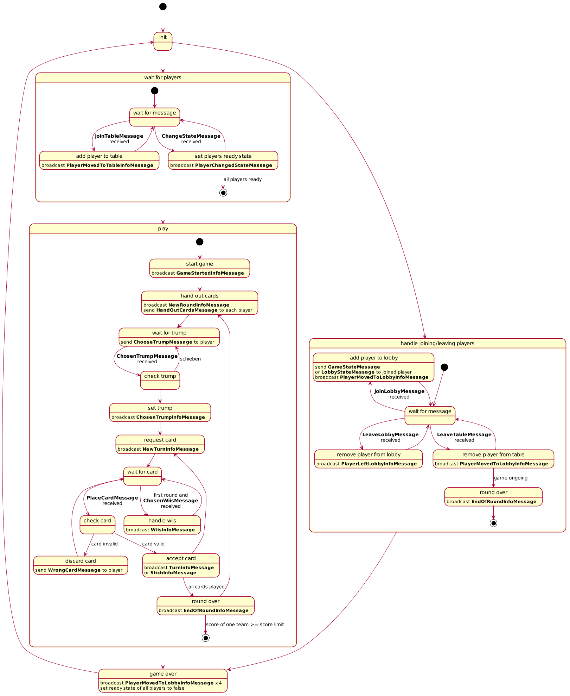

### Server State Diagram

Can be edited with either the [online editor](http://www.plantuml.com/plantuml/uml) (paste content of StateDiagram.plantuml in the textbox) or locally (render with https://sourceforge.net/projects/plantuml/files/plantuml.jar/download).

